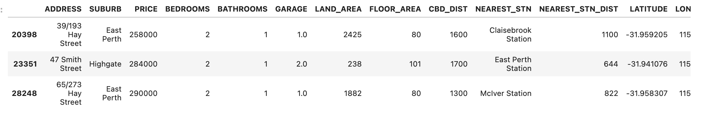

# Project-1-TEAM-ONE

 

## Our Passion
From data to lifestyle, our passion is searching databases and refining solutions into a visual formats based on your parametres. Our story comes from our underlieing strategy of good service and great analysistics. Additionally, our Solutions Architects have worked with our finance team to develop a configurable tool (easier than your iPhone) that will just work! Tried and tested in the Australian marketplace, we wanted people to get hooked on realestate in Perth and with our 'Super Property Selection Tool' (SPST) you will! We have close ties with industry and with the announcement of the Rio / China deal, (a new $2 Billion dollar investment) Perth is stacking up to be one of the best kept secrets in the country.

## Our Approach
Our experienced data analysists have been working tirelessly with our finance team to bring you our market leading tool that refines your best options based on key criteria without wasting your time. We bring the latest data from a wide range of suburbs and bring it all together for you. We have achieved high accuracy with easy refinement based on your criteria. 

Customer service is at the heart of what we do, our vision was to visualisatally create a list of top properties that fit your criteria, displayed on a simple map for your use. Our tool is configurable to your search criteria. Our 'SPSTool' is the single source of truth when it comes to your property search, financing or investing research. Our experienced professionals have extensive experience in their choosen fields and are here to assist you with anything you need. Your criteria will refine your selection as we walk you through the process from enquiry to location or discover your budget via our calculator... lets build your real estate story.
# #

# Table of Contents
- The TEAM ONE development structure

- Introducing the TEAM ONE Project Team

- The data sources

- Our notebook

- How the code works

- Demonstration Customer 1

    - House section

    - Mortage and Stamp Duty Calculator

- Demonstration Customer 2

    - House section

    - Mortage and Stamp Duty Calculator

- Future development of our tool

    - Rental Calculator
    - Pricing change predictor
    - ROI Tools

- The Project_ Masterfile.ipynb
#   # 
## The TEAM ONE developement structure:

Figure 1: The Project 1 Team structure.
   ---   

## Introducing your TEAM ONE Project Team:

1.  Akhil - Subject Matter expert
2.  Vicky - Finance Manager - speciallising in loan structures
3.  Lachlan - Project Director and Customer 2
4.  Danni - Code Strategy and Demonstration Customer 1
5.  Leigh - Analysis and Media services
## The data sources
We have searched, extrapoloted and cleaned data from sites including Kaggle and 'Real Estate Property Price' to look at historic and current valuations. After appliying our metrics across the different data sets we are able to present the data that is important to you to make an informed decision.
## Our notebook
Our in-house team has created a simple to use program, analysised and compared different data sets to arrive on our proven formula. An API reads in the Kaggle data set in real time before nulls and unneccesary data is dropped. A second set of data colloated in a csv file is imported and checked before setting the index as 'Suburb'. This allows us to easily concatenate the data sets into a new DataFrame. We then correct percentages into floats before it can be presented in an easy to read interactive hvplot.

## How the code works
Using our proprietry DataFrame, the client can then simply answer some simple promotes to refine their Real Estate searches. Our clients enter their preferrences on;
- Number of bedrooms
- Budget 
- Distance from CDB
- Preferred land size

It is ok if they dont have all the answers in the beginning. Our system will bring forward some great suggetions to get you started. The below output is based on selection inputs including; 2 bedrooms, a budget of $280,000 and it should be walking distance from the CBD, in which case we suggested 2000mtrs would be a nice walking disctance. No other inputs were required to pull the following properties from our DataFrame.

This ouput result above is then plotted on an interactive map for the client to easily visualise postion and disctance from schools, waterfront or in this case the CBD.

We have included other elements that come into Real Estate evaluation including assessing median house price growth, mortage and stamp Duty calculators to help you make to right choice for you situation.

Lets discover your opportunities and enter what you know into this powerfully efficient tool.

**Customer Example 1:**

#### Some criteria for selection
- How many bedrooms do you prefer?
- Would you like minimum land size?
- Do you have an ideal distance form the CBD?
- Do you have a budget in mind?

#  #

# Conclusion and next steps...
As you have seen from the above examples by pulling data through our API and concatenating with our latest data, we are able to provide clarity and opportunity for your consideration. It should be noted that this service is still at the early stages of development and we intend to continue to advance the tool to help more people move to Western Australia. Our tool currently interates over 324 suburbs. 

You can assess potential growth of a suburb and preferred distance form you chosen school however in the very near future our SPSTool_V2 will be taking things to the next level. Suburb build years, Median House price formula refinement, Heat maps, investor solutions, ROI and rental assessments will compliment this great tool. A snap shot of these outputs are provided below:

##  

Now ask yourself:
- What is your budget?
- How Many Bedrooms would you like?

We know that some things may change as we go through this journey. You may not have all the answers to every question ... but you will. Lets give it a go. Picture your dream home or your next investment property! Whether you live, work or play in WA, Perth is presenting as a great opportuny for the savy client.

